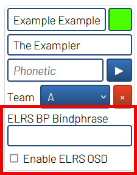
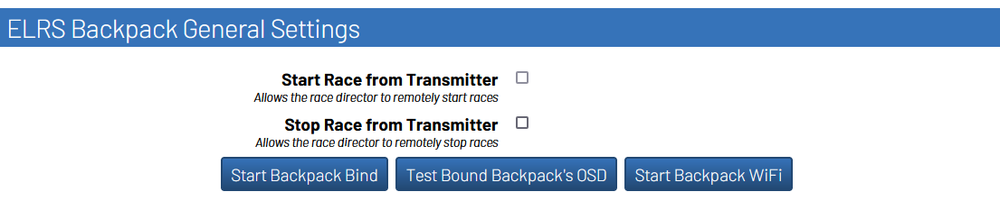
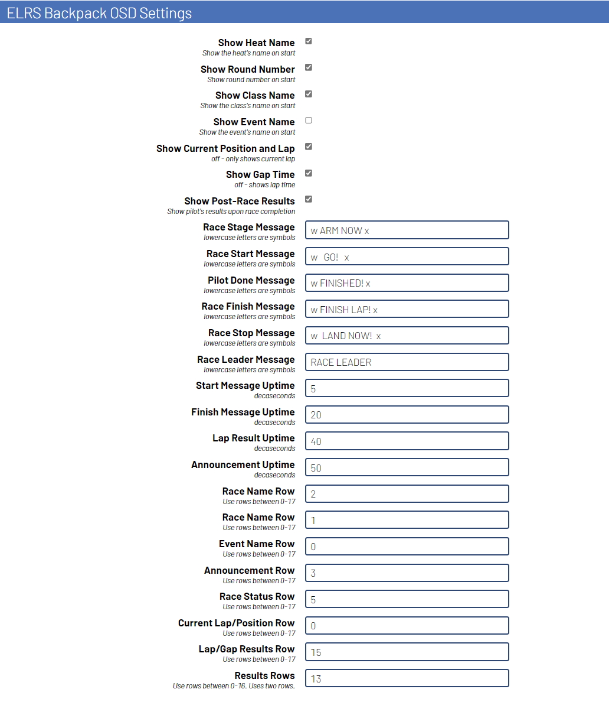
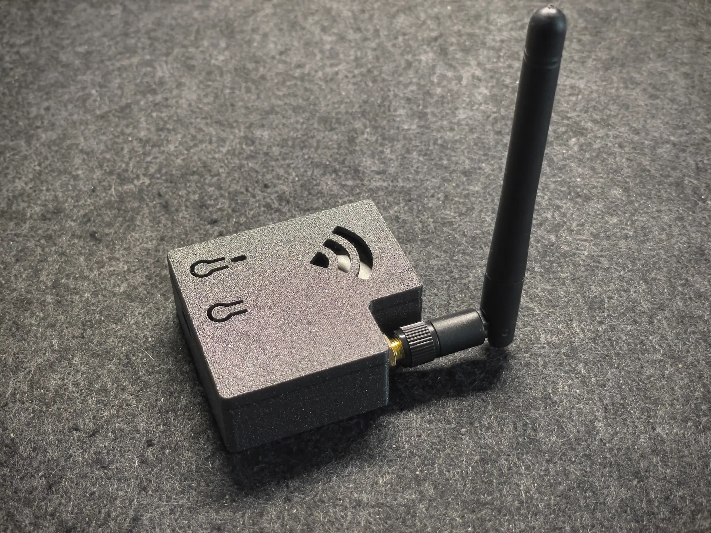

# RotorHazard VRx Control for the ExpressLRS Backpack

> [!NOTE]
> The use of this plugin is dependent on the release of the v1.5 of the ELRS Backpack. It is recommended to wait for this release of the backpack if not yet available.
> This version provides the following critical features for the plugin to work:
> - Timer backpack targets for RotorHazard
> - Improvements to the HDZero goggle's backpack ability to rapidly receive OSD messages

This is a plugin being developed for the RotorHazard timing system with the following features: 
- [X] Send OSD messages to pilots using compatible equipment (such as the [HDZero goggles](https://www.youtube.com/watch?v=VXwaUoA16jc)) 
- [X] Allows for the race manager to start the race from their transmitter
- [ ] Automatically switching pilot's video channels and output power 

## Requirements

- RotorHazard v4.1.0+ is required to run the plugin
- A connected device that can run the ExpressLRS Timer Backpack (available in the v1.5 release)
    - Connections over USB or UART will both work

## Installation

### Installing RH Plugin

To install, follow the instructions on the [latest release](https://github.com/i-am-grub/VRxC_ELRS/releases) of the plugin.

### Installing Backpack on HDZero Goggles

To build the firmware for your HDZero goggles, use the [ExpressLRS Configurator](https://github.com/ExpressLRS/ExpressLRS-Configurator/releases).
Select `Backpack` on the left side menu. Select the 1.5.0 release (or a newer version), find the HDZero goggle target, enter your bindphrase, and
build the firmware.

To install, follow the instructions on the [ExpressLRS Docs](https://www.expresslrs.org/hardware/backpack/hdzero-goggles/).

### Installing the Timer Backpack

Available devices for the RotorHazard Timer Backpack category in the ELRS Configurator. It is recommended to use a chip that is capable of connecting an external wifi antenna.

| ELRS Device           | Compatible Hardware                                                                                                   |
| --------------------- | --------------------------------------------------------------------------------------------------------------------- |
| EP82 Module (DIY)     | [ESP8266 NodeMCU](https://a.co/d/9vgX3Tx)                                                                             |
| EP32 Module (DIY)     | [ESP32-DevKitC](https://a.co/d/62OGBgG)                                                                               |
| EP32C3 Module (DIY)   | [ESP32-C3-DevKitM-1U](https://www.digikey.com/en/products/detail/espressif-systems/ESP32-C3-DEVKITM-1U/15198974)      |
| EP32S3 Module (DIY)   | [ESP32-S3-DevKitC-1U](https://www.digikey.com/en/products/detail/espressif-systems/ESP32-S3-DEVKITC-1U-N8R8/16162636) |
| NuclearHazard         | [NuclearHazard Board](https://www.etsy.com/listing/1428199972/nuclearhazard-core-kit-case-and-rx-sold) v7 or newer    |

While other specific development boards with similar chipsets may be supported by the targets in the table, it is not guaranteed that they work.
For example, the Seeed Studio XIAO ESP32C3/S3 board do not work with the targets listed above, but when using the 
[ExpressLRS Toolchain](https://www.expresslrs.org/software/toolchain-install/) for building the backpack firmware, you can
change the platformio settings to build the firmware to use the XIAO boards for the timer backpack.

#### Non-NuclearHazard Hardware

To build and flash the firmware, use the [ExpressLRS Configurator](https://github.com/ExpressLRS/ExpressLRS-Configurator/releases)
1. Connect the device to your computer over USB.
2. Select `Backpack` on the left side menu. 
3. Select the 1.5.0 release (or a newer version) 
4. Select the RotorHazard device category
5. Select the target for your device
6. Select the UART flashing method
7. Enter the bindphrase (for race control from the director's transmitter)
8. Select the COM port for your device
9. Build and flash the firmware

#### NuclearHazard Hardware

To build the firmware, use the [ExpressLRS Configurator](https://github.com/ExpressLRS/ExpressLRS-Configurator/release)
1. Select `Backpack` on the left side menu. 
2. Select the 1.5.0 release (or a newer version) 
3. Select the RotorHazard device category
4. Select NuclearHazard as your device
5. Select the WIFI flashing method
6. Enter the bindphrase (for race control from the director's transmitter)
7. Build the firmware
8. Follow [this guide](https://nuclearquads.github.io/vrxc) to flash the on board ESP32. Instead of downloading the backpack bin files, use the files you built with the configurator.

## Control the Race from the Race Director's Transmitter

There is a feature to control the race from the race director's transmitter by tracking the position of the `DVR Rec` switch setup within the transmitter's backpack. It currently works
by binding the race timer's backpack to the race director's bindphrase similarly like you would do with the transmitter and VRx backpacks. 

Currently only starting and stopping the race are supported. Setting up this feature will not prevent other users from receiving OSD messages.

> [!IMPORTANT]
> This feature requires the Race Director to have the ELRS Backpack setup on their transmitter. Please ensure this is setup before completing the following instructions.

1. Setup the `DVR Rec` switch in the ELRS backpack
    1. Open the ExpressLRS Lua script (v3 is recommended) on the transmitter
    2. Open up the Backpack settings
    3. Set the AUX channel for `DVR Rec`

> [!NOTE]
> Note: This will not stop the ability to start recording DVR through this switch. It is just a state that the race timer's backpack listens for.

2. Bind the Race Timer backpack to the Transmitter. This step can be skipped if flashing the timer's backpack with firmware that contains the race director's bindphrase.
    1. Start the RotorHazard server with the ESP32 connected.
    2. Navigate to the `ELRS Backpack General Settings` panel.
    3. Click the `Start Backpack Bind` button.
    4. Within the ExpressLRS Lua script on the transmitter, click `Bind`

To test to see if the backpack was bound successfully, navigate to the `Race` tab within RotorHazard, and use the `DVR Rec` switch to start the race. `Race Control from Transmitter` will need to be enabled under `ELRS Backpack General Settings`

> [!TIP]
> Anytime the backpack needs to be bound to a new transmitter, it will be easiest to reflash the ESP32 with the firmware in the latest release, and then rebind.

## Settings

### Pilot Settings

#### Backpack Bindphrase : TEXT

The pilot's individual bindphrase for their backpack. If a bindphrase is not set, the pilot's callsign will be used as the bindphrase instead.

#### Enable ELRS OSD : CHECKBOX

Turns the pilot's ELRS OSD on/off

### ELRS Backpack General Settings

#### Start Race from Transmitter : CHECKBOX

Allows the race director to start the race from their transmitter. Please navigate to [here](https://github.com/i-am-grub/VRxC_ELRS#control-the-race-from-the-race-directors-transmitter) for binding the backpack.

#### Stop Race from Transmitter : CHECKBOX

Allows the race director to stop the race from their transmitter. Please navigate to [here](https://github.com/i-am-grub/VRxC_ELRS#control-the-race-from-the-race-directors-transmitter) for binding the backpack.

#### Start Backpack Bind : BUTTON

Puts the timer's backpack into a binding mode for pairing with the race director's transmitter.

> [!TIP]
> After successfully completing this process, the timer's backpack will inherit the race director's bindphrase from the transmitter.

#### Test Bound Backpack's OSD : BUTTON

Will display OSD messages on HDZero goggles with a matching bindphrase. Used for testing if the timer's backpack successfully inherited the transmitter's bindphrase.

#### Start Backpack WiFi : BUTTON

Starts the backpack's WiFi mode. Used for over-the-air firmware updates. Open the URL http://elrs_timer.local on your browser.

### ELRS Backpack OSD Settings

#### Show Race Name on Stage : CHECKBOX

Shows the race name on start.

> [!NOTE]
> Requires the race's class and heat names to be set

#### Show Current Position and Lap : CHECKBOX

- TOGGLED ON: Shows current position and current lap when multiple pilots are in a race
- TOGGLED OFF: Only shows current lap

#### Show Gap Time : CHECKBOX

- TOGGLED ON: Shows the gap time to next pilot if using a compatible win condition for the race
- TOGGLED OFF: Shows lap result time

#### Show Post-Race Results : CHECKBOX

The pilot will be shown results when they finish the race. It is recommended to have pilots turn off `Post Flight Results` in Betaflight so the results won't be overridden when the pilot lands.

#### Race Stage Message : TEXT

The message shown to pilots when the timer is staging the race

#### Race Start Message : TEXT

The message shown to pilots when the race first starts

#### Pilot Done Message : TEXT

The message shown to pilots when the pilot finishes

#### Race Finish Message : TEXT

The message shown to pilots when the time runs out

#### Race Stop Message : TEXT

The message shown to pilots when the race is stopped

#### Race Leader Message : TEXT

The message shown to pilots when `Show Gap Time` is enabled and the pilot is leading the race

#### Start Message Uptime : INT

The length of time `Race Start Message` is shown to pilots

#### Finish Message Uptime : INT

The length of time `Pilot Done Message` and `Race Finish Message` is shown to pilots

#### Lap Result Uptime : INT

Length of time the pilot's lap or gap time is shown after completing a lap. 

#### Announcement Uptime : INT

Length of time to show announcements to pilots. (e.g. When a race is scheduled)

#### Race Status Row : INT

Row to show race status messages.

#### Current Lap/Position Row : INT

Row to show current lap and position

#### Lap/Gap Results Row : INT

Row to show lap or gap time

#### Announcement Row : INT

Row to show announcements such as when a race is scheduled. This row is also used by `Show Race Name on Stage`

#### Results Rows : INT

The row to start showing a pilot's post race statistics on. It will also use the follow row in conjunction with the entered one.

## 3D Printed Case

If you are looking to have a case for an externally connected ESP32-DevKitC-1U board, users have commonly liked to use the
following 3D printable case available on [Printables](https://www.printables.com/model/762529-esp32-wroom-32u-casing)

