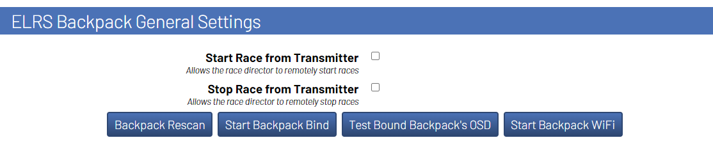

# RotorHazard VRx Control for the ExpressLRS Backpack

> [!NOTE]
>The timeline for the first offical release of this plugin is currently dependent on the stability of the following items:
>- this plugin
>- a new [timer backpack](https://github.com/ExpressLRS/Backpack/pull/114)
>- the backpack for the HDZero goggles

This is a plugin being developed for the RotorHazard timing system with the following features: 
- [X] Send OSD messages to pilots using compatible equipment (such as the [HDZero goggles](https://www.youtube.com/watch?v=VXwaUoA16jc)) 
- [X] Allows for the race manager to start the race from their transmitter
- [ ] Automatically switching pilot's video channels and output power 

## Requirements

- RotorHazard v4.0.0+ is required to run the plugin
- A connected device that can run the ExpressLRS Backpack
    - Connections over USB or UART will both work

## Installation

### Installing RH Plugin and Backpack

To install, follow the instructions on the [latest release](https://github.com/i-am-grub/VRxC_ELRS/releases) of the plugin.

### Installing Backpack on HDZero Goggles

To install, follow the instructions on the [latest release](https://github.com/i-am-grub/VRxC_ELRS/releases) of the plugin.

## Control the Race from the Race Director's Transmitter

There is a feature to control the race from the Race Director's transmitter by tracking the position of the `DVR Rec` switch setup within the ransmitter's backpack. Currently only starting and stopping the race are supported.

> [!IMPORTANT]
> This feature requires the Race Director to have the ELRS Backpack setup on their transmitter. Please ensure this is setup before completing the following instructions.

1. Setup the `DVR Rec` switch in the ELRS backpack
    1. Open the ExpressLRS Lua script (v3 is recommended) on the transmitter
    2. Open up the Backpack settings
    3. Set the AUX channel for `DVR Rec`

> [!NOTE]
> Note: This will not not stop the ability to start recording DVR through this switch. It is just a state that the race timer's backpack listens for.

> [!CAUTION]
> It is recommended to not use the same AUX channel as your ARM switch. 

2. Bind the Race Timer backpack to the Transmitter
    1. Start the RotorHazard server with the ESP32 connected.
    2. Navigate to the `ELRS Backpack General Settings` panel.
    3. Click the `Start Backpack Bind` button.
    4. Within the ExpressLRS Lua script on the transmitter, click `Bind`

To test to see if the backpack was bound sucessfully, navigate the the `Race` tab within RotorHazard, and use the `DVR Rec` switch to start the race. `Race Control from Transmitter` will need to be enabled under `ELRS Backpack General Settings`

> [!TIP]
> Anytime the backpack needs to be bound to a new transmitter, it will be easiest to reflash the ESP32 with the firmware in the latest release, and then rebind. Attempting to rebind after the 

## Settings

### Pilot Settings

#### ELRS VRx Hardware : SELECTOR

Select the type of hardware that the pilot is using. To turn off OSD messages for a pilot, leave this option blank or set to `NONE`. In the graphic showing the pilot settings at the start of this section, Pilot 1 and Pilot 2 have OSD messages enabled - all other pilots have the option disabled

> [!TIP]
> Less pilots with OSD messages turned on means less delay is present for pilots with OSD messages turned on.

#### Backpack Bindphrase : TEXT

The pilot's individual bindphrase for their backpack. If a bindphrase is not set, the pilot's callsign will be used as the bindphrase instead.

### General Settings

#### Race Control from Transmitter : CHECKBOX

Toggles the ability for the bound transmitter to start a race. Please navigate to [here](https://github.com/i-am-grub/VRxC_ELRS#control-the-race-from-the-race-directors-transmitter) for binding the backpack.

#### Number of times to repeat messages : INT

A setting to help with dropped packets. This setting determines the number of times a message should be repeated every time it is sent.

> [!IMPORTANT]
> It is advised that the Race Director should try to find the values that work best for their group. Inceasing the number may help with dropped packets, but will decrease ideal peformance. This setting will likely be removed in the first full release of the plugin. 

> [!TIP]
> this setting should be tuned to be as low as possible.

#### Send delay between messages : INT

A setting to help with dropped packets. This setting determines the speed at which the backpack sends messages.

> [!IMPORTANT]
> It is advised that the Race Director should try to find the values that work best for their group. Inceasing the number may help with dropped packets, but will decrease ideal peformance. This setting will likely be removed in the first full release of the plugin.

> [!TIP]
> this setting should be tuned to be as low as possible.

#### Start Backpack Bind : BUTTON

Puts the timer's backpack into a binding mode for pairing with the race director's transmitter.

> [!TIP]
> After sucessfully completing this process, the timer's backpack will inherit the race director's bindphrase from the transmitter.

#### Test Bound Backpack's OSD : BUTTON

Will display OSD messages on HDZero goggles with a matching bindphrase. Used for testing if the timer's backpack sucessfully inherited the transmitter's bindphrase.

#### Start Backpack WiFi : BUTTON

Starts the backpack's WiFi mode. Used for over-the-air firmware updates.

### OSD Settings

#### Show Race Name on Stage : CHECKBOX

Shows the race name on start.

> [!NOTE]
> Requires the race's class and heat names to be set

#### Show Current Position and Lap : CHECKBOX

- TOGGLED ON: Only shows current lap
- TOGGLED OFF: Shows current position and current lap when multiple pilots are in a race

#### Show Gap Time : CHECKBOX

- TOGGLED ON: Shows lap result time
- TOGGLED OFF: Shows the gap time to next pilot

#### Show Post-Race Results : CHECKBOX

The pilot will be shown results when they finish the race. It is recommeded to turn off `Post Flight Results` in Betaflight so the results won't be overridden when the pilot lands.

> [!NOTE]
> Rows 10-14 in the HDZero goggle's OSD are used by this feature

#### Race Stage Message : TEXT

The message shown to pilots when the timer is staging the race

#### Race Start Message : TEXT

The message shown to pilots when the race first starts

#### Pilot Done Message : TEXT

The message shown to pilots when the pilot finishes

#### Race Finish Message : TEXT

The message shown to pilots when the time runs runs out

#### Race Stop Message : TEXT

The message shown to pilots when the the race is stopped

#### Race Leader Message : TEXT

The message shown to pilots when `Show Gap Time` is enabled and the pilot is leading the race

#### Start Message Uptime : INT

The length of time `Race Start Message` is shown to pilots

#### Finish Message Uptime : INT

The length of time `Pilot Done Message` and `Race Finish Message` is shown to pilots

#### Lap Result Uptime : INT

Length of time the pilot's lap or gap time is shown after completing a lap. 

#### Announcement Uptime : INT

Length of time to show announcements to pilots. (e.g. When a race is scheduled)

#### Race Status Row : INT

Row to show race status messages.

> [!NOTE]
> Rows 10-14 are used by `Show Post-Race Results` when it is enabled. You can use these rows if the feature is disabled.

#### Current Lap/Position Row : INT

Row to show current lap and position

> [!NOTE]
> Rows 10-14 are used by `Show Post-Race Results` when it is enabled. You can use these rows if the feature is disabled.

#### Lap/Gap Results Row : INT

Row to show lap or gap time

> [!NOTE]
> Rows 10-14 are used by `Show Post-Race Results` when it is enabled. You can use these rows if the feature is disabled.

#### Announcement Row : INT

Row to show announcements such as when a race is scheduled. This row is also used by `Show Race Name on Stage`

> [!NOTE]
> Rows 10-14 are used by `Show Post-Race Results` when it is enabled. You can use these rows if the feature is disabled.
## 3D Printed Case
Available on Printables
https://www.printables.com/model/762529-esp32-wroom-32u-casing

